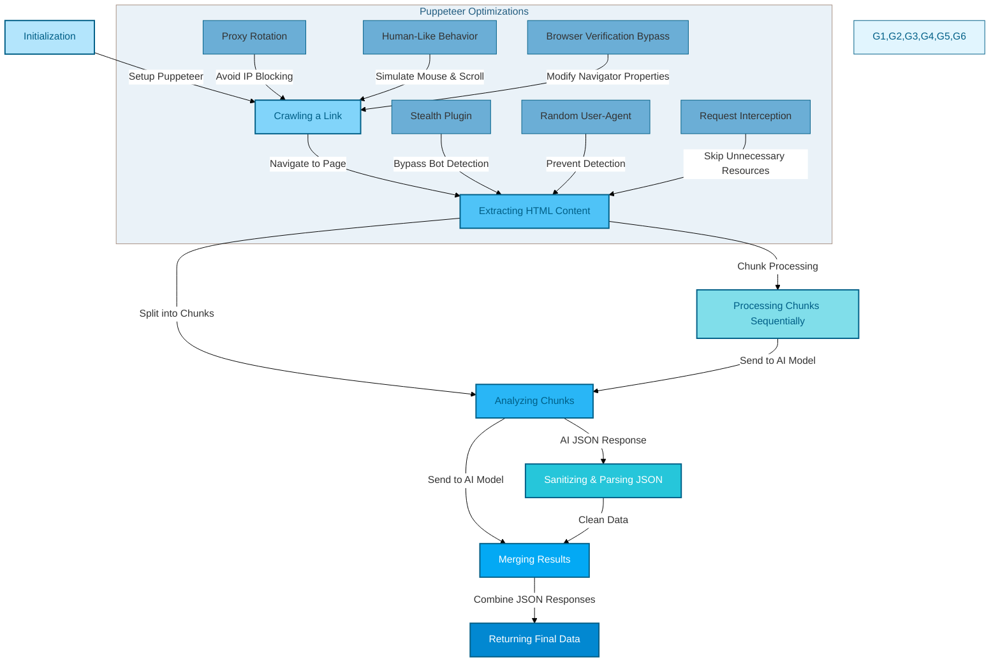
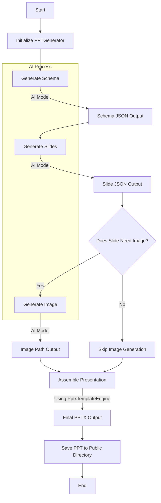

# Together-Agents

Together-Agents is a set of Web AI Agents, currently it only consist of the `webcrawler` data analysis AI Agent and  `PPT Generator`. It leverages Puppeteer for web scraping and together-ai  free AI API's for scraped data analysis. The project is designed to support multiple routes providing a window to the web AI Agents.

## Table of Contents

- [Webcrawler](#webcrawler)
    - [Usage](#usage-webcrawler) 
- [PPT Generator](#ppt-generator)
    - [Usage](#usage-ppt-generator)
- [Installation](#installation)
- [Dependencies](#dependencies)
- [Contributing](#contributing)

## Webcrawler

Webcrawler can crawl to any url, extract data, and perform analysis on the collected information. The web crawler is mildly optimized, using puppeteer-extra plugins, random-useragents, simulating human behaviour and real browser and using open source available proxies to vist any site.

## How it Works?

The web crawler leverages Puppeteer, a powerful headless browser automation tool, to navigate and extract data from web pages. The process involves several key steps and optimizations to ensure efficient and effective data extraction. Below is a detailed explanation of how the web crawler works, including the use of Puppeteer optimizations and the analysis of HTML content in chunks.



### Puppeteer Optimizations

1. **Stealth Plugin**:
   - The `puppeteer-extra-plugin-stealth` is used to make Puppeteer less detectable by websites. This plugin helps in bypassing common anti-bot mechanisms.

2. **Random User-Agent**:
   - The `random-useragent` library is used to generate random user-agent strings, making it harder for websites to detect automated requests.

3. **Proxy Rotation**:
   - The crawler fetches a list of proxies and rotates through them to avoid IP blocking. This is managed by the `fetchProxyList` function and the `launchBrowserWithProxy` method.

4. **Request Interception**:
   - Puppeteer intercepts network requests to skip loading stylesheets, fonts, and images, which improves performance by reducing the amount of data transferred.

5. **Human-Like Behavior**:
   - The `emulateHumanBehavior` method introduces random mouse movements, scrolls, and clicks to mimic human behavior, further reducing the likelihood of being detected as a bot.

6. **Browser Verification Bypass**:
   - The `bypassVerification` method overrides various navigator properties to mimic a real browser, including `webdriver`, `chrome`, `plugins`, `languages`, `platform`, `hardwareConcurrency`, `deviceMemory`, `userAgent`, `vendor`, `maxTouchPoints`, `connection`, `productSub`, `appVersion`, `product`, `appCodeName`, and `appName`.

### Analysis of HTML Content

The `analysis.js` file contains functions to process and analyze the HTML content extracted by Puppeteer. The key steps involved are:

1. **Chunking HTML Content**:
   - The `chunkContent` function splits the HTML content into manageable chunks. This is necessary because the AI model used for analysis has a token limit, and splitting the content into smaller parts ensures that each part can be processed individually.

2. **Processing Chunks Sequentially**:
   - The `analyze` function processes each chunk sequentially. It sends each chunk to the AI model for analysis and collects the JSON responses.

3. **Merging JSON Responses**:
   - The `mergeJsonObjects` function merges the JSON responses from each chunk into a single JSON object. This ensures that the final output is a comprehensive representation of the extracted data.

4. **Sanitizing and Parsing JSON**:
   - The `sanitizeAndParseJson` function sanitizes the JSON responses from the AI model and parses them into JavaScript objects. This ensures that the data is in a usable format.

### Detailed Steps

1. **Initialization**:
   - The `PuppeteerService` class is initialized with various settings, including proxy rotation, request interception, and human-like behavior emulation.

2. **Crawling a Link**:
   - The `crawl` method navigates to the specified link using Puppeteer. It handles retries with different proxies if the initial attempt fails.

3. **Extracting HTML Content**:
   - The `crawl` method extracts the HTML content of the page and splits it into chunks using the `chunkContent` function from `analysis.js`.

4. **Analyzing Chunks**:
   - Each chunk is sent to the AI model for analysis using the `analyze` function from `analysis.js`. The AI model extracts relevant information from each chunk and returns a JSON response.

5. **Merging Results**:
   - The JSON responses from each chunk are merged into a single JSON object using the `mergeJsonObjects` function from `analysis.js`.

6. **Returning Results**:
   - The final merged JSON object is returned, containing all the extracted data from the web page.

### Summary

The web crawler leverages Puppeteer to navigate web pages and extract HTML content. It uses various optimizations to avoid detection and improve performance. The extracted HTML content is split into chunks and analyzed using an AI model to extract relevant data. The results from each chunk are merged into a single JSON object, providing a comprehensive representation of the extracted data.

This approach ensures that the web crawler can efficiently and effectively extract data from web pages, even those with complex structures and anti-bot mechanisms.

## Features

- Web crawling using Puppeteer and LLM
- Data analysis utilities
- Environment configuration with dotenv

## Usage Webcrawler

1. Start the application:
   ```sh
   npm start
   ```

2. The application will start at port 8080. You can do a post request to the `/webcrawler` route with the following payload.

```json
{
  "link":"https://example.com",
  "source" : 0, // 0 for Meta Llama 3.3 Turbo Instruct , 1 for DeepSeek R1
  "prompt": "Please extract the following data:"
}

```

<br/><br/>


## PPT Generator

The `ppt_generator` module is a powerful tool for generating PowerPoint presentations using AI models. It leverages the `together-ai` library for AI-driven content generation and the `PptxTemplateEngine` for creating presentation slides.

### How it Works?

The `ppt_generator` module uses AI models to generate the structure and content of PowerPoint presentations. The process involves several key steps:



1. **Initialization**:
   - The `PPTGenerator` class is initialized with various settings, including the AI client, models, and system prompts.

2. **Generating Schema**:
   - The `generateSchema` method sends a prompt to the AI model to generate the overall structure of the presentation, including the number of slides and their types.

3. **Generating Slides**:
   - The `generateSlide` method generates the content for each slide based on the schema. It sends the slide title and description to the AI model, which returns a JSON object representing the slide's layout and content.

4. **Generating Images**:
   - The `generateImage` method generates images based on text prompts using the AI model. It returns the path to the generated image.

5. **Assembling the Presentation**:
   - The `generatePresentation` method assembles the slides into a final PowerPoint presentation using the `PptxTemplateEngine`. It handles the layout and formatting of each slide based on the JSON content generated by the AI model.

### Detailed Steps

1. **Initialization**:
   - The `PPTGenerator` class is initialized with the AI client, models, and system prompts. It also sets up the template engine with the specified color scheme.

2. **Generating Schema**:
   - The `generateSchema` method sends a prompt to the AI model to generate the presentation schema. It returns a JSON object representing the structure of the presentation.

3. **Generating Slides**:
   - The `generateSlide` method generates the content for each slide based on the schema. It sends the slide title and description to the AI model, which returns a JSON object representing the slide's layout and content.

4. **Generating Images**:
   - The `generateImage` method generates images based on text prompts using the AI model. It returns the path to the generated image.

5. **Assembling the Presentation**:
   - The `generatePresentation` method assembles the slides into a final PowerPoint presentation using the `PptxTemplateEngine`. It handles the layout and formatting of each slide based on the JSON content generated by the AI model.

### AI Process

The AI process involves several steps to generate the content for each slide:

1. **Schema Generation**:
   - The AI model generates the overall structure of the presentation, including the number of slides and their types. This is done by sending a prompt to the AI model, which returns a JSON object representing the schema.

2. **Slide Generation**:
   - For each slide in the schema, the AI model generates the content based on the slide title and description. This is done by sending the slide title and description to the AI model, which returns a JSON object representing the slide's layout and content.

3. **Image Generation**:
   - If a slide requires an image, the AI model generates the image based on a text prompt. This is done by sending the text prompt to the AI model, which returns the path to the generated image.

4. **Presentation Assembly**:
   - The `PptxTemplateEngine` assembles the slides into a final PowerPoint presentation. It handles the layout and formatting of each slide based on the JSON content generated by the AI model.

### Summary

The `ppt_generator` module leverages AI models to generate PowerPoint presentations. It uses the `together-ai` library for AI-driven content generation and the `PptxTemplateEngine` for creating presentation slides. The module handles the initialization, schema generation, slide generation, image generation, and assembly of the final presentation.

This approach ensures that the `ppt_generator` module can efficiently and effectively generate PowerPoint presentations with AI-driven content.

## Features

- AI-driven content generation
- Customizable themes
- Image generation based on text prompts
- Flexible layouts for slides

## Usage PPT Generator

1. Start the application:
   ```sh
   npm start
   ```

2. The application will start at port 8080. You can do a post request to the `/generate/ppt` route with the following payload.
    ```json
    {
      "prompt": "Your presentation prompt"
    }
    ```

- **Note**: PPT's are saved in the **`public`** directory.


## Installation

1. Clone the repository:
   ```sh
   git clone https://github.com/yourusername/together-agents.git
   cd together-agents
   ```

2. Install the dependencies:
   ```sh
   npm install
   ```

3. Set up environment variables:
   Create a `.env` file in the root directory and add the necessary environment variables. For example:
   ```env
   API_KEY=TOGETHER_AI_API_KEY
   ```

## Dependencies

The project uses the following dependencies:

- `dotenv`: ^16.4.7
- `express`: ^4.21.2
- `puppeteer`: ^24.1.1
- `puppeteer-extra`: ^3.3.6
- `puppeteer-extra-plugin-stealth`: ^2.11.2
- `random-useragent`: ^0.5.0
- `sqlite3`: ^5.1.7 -> `For future use cases 😀`
- `together-ai`: ^0.13.0
- `pptxgenjs`: ^3.1.0

## Contributing

Contributions are welcome! Please follow these steps:

1. Fork the repository.
2. Create a new branch for your feature or bug fix.
3. Make your changes and commit them with descriptive messages.
4. Push your changes to your fork.
5. Create a pull request to the main repository.
6. Open to new modules.
